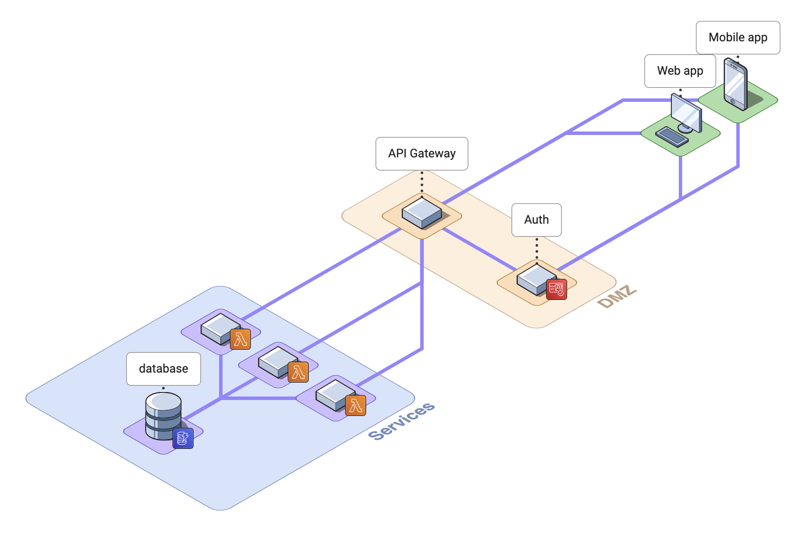

# mvp-rocketship-template

A simple template to develop, publish, and test a simple .NET service backend on AWS, with serverless Lambda functions, supported by DynamoDb, behind an API Gateway, and protected by Cognito auth. 🚀

_Hopefully this will accelerate some early prototyping for some of my projects, and perhaps you'll find it useful as a reference too._

## Design

The rocket ship design...



Included in this template:

- [x] SAM template
- [x] Sample function (Lambda)
- [x] API Gateway
- [x] Database (DynamoDb)
- [x] Auth (Cognito)

Not included in this template:

* Web and mobile client apps

## AWS services and costs

AWS should come with a warning - if you exceed the free tier, you'll be billed. There's no easy way to set a cap on consumption, so keep an eye on your usage.

This design shouldn't be too hard on the budget during development and prototyping. Here's a quick breakdown of each AWS service used, and their free tiers:

| Service | Purpose | Free tier | Free limit |
|-|-|-|-|
| CloudFormation | Deployment stacks | Always free | 1k handler operations pcm per account |
| DynamoDb | Data storage | Always free | 25Gb storage; 200m requests pcm |
| Lambda | Serverless functions | Always free | 1m requests pcm; 3.2m secs compute pcm |
| API Gateway | API endpoints | 12 months | 1m API calls pcm |
| Cognito | Authentication | Always free | 50k active users pcm |

* AWS free tiers and specifics for each service: https://aws.amazon.com/free/

## Prerequisites

This template assume you're working on a Mac with [Homebrew](https://brew.sh/) installed and `bash` available. If not, very little should be different - but you'll need alternative commands for your OS to install the tools.

```shell
brew install awscli
brew install aws-sam-cli
brew install --cask aws-vault
brew install --cask dotnet-sdk
```

### Optional tools

* VSCode AWS Toolkit extension

## Init

### Set up IAM in the AWS console

* Create an IAM user for the aws cli and SAM to use (eg. `administrator`)
  * Choose access keys, rather than username/password
* Get the credentials for the user (access key id, secret access key)
* Grant the new user administrative permissions, eg. the `AdministratorAccess` policy

### Set up your local machine

`cat ~/.aws/config` and `aws-vault list` to see your currently configured profiles.

* Add the credentials to `aws-vault`, ie.
  ```shell
  aws-vault add administrator
  ```
* Add the profile to `~/.aws/config`, eg.
  ```ini
  [profile administrator]
  region=eu-west-2
  output=json
  ```

## Deployment scripts

* `deploy-stack-aws.sh -a <profile-name> -s <stack-name>` - build and deploy to AWS
* `delete-stack-aws.sh -a <profile-name> -s <stack-name>` - delete a given stack on AWS

In each case, you must provide a profile and stack.

## Auth

On first deployment, you new test user will receive a temporary password by email. You'll need to set the password on first use with the `first-time-set-password.sh` script:

```shell
auth-scripts/first-time-set-password.sh \
  -a <aws-profile> \
  -u <user-email> \
  -t <temporary-password> \
  -p <new-password> \
  --client-id <cognito-client-id> \
  --user-pool-id <cognito-user-pool-id>
```

You may need to use the `--region` parameter if your default region is not set to `eu-west-2`.

`cognito-client-id` and `cognito-user-pool-id` can be obtained from the deployed stack outputs.

You could use the `IdToken` output from this script as the `Authorization: Bearer` heading value in calls to the API Gateway. eg.

```shell
curl -H "Authorization: Bearer <IdToken>" https://endpoint.uri.etc.
```

For all subsequent calls where you need a token, you can use the output from `get-user-id-token.sh`, eg.

```shell
export ID_TOKEN=$(auth-scripts/get-user-id-token.sh -u <username> -p <password> -ci <cognito-client-id>)
curl -H "Authorization: Bearer $ID_TOKEN" https://endpoint.uri.etc.
```

## Exercising the functions

To illustrate the flexibility, `FunctionOne` actually contains two handlers, and the template deploys two functions - one for each.

For convenience of exploration, each deployed function is also mapped to two endpoints (one with auth, one without). When developing your application, give some though to which endpoints need authentication and which don't.

| Handler | Endpoint | Method | Notes |
|-|-|-|-|
| `FunctionOne.HandlerRoot:Handle` | /FunctionOne/ | Any | Returns "ok". | 
| `FunctionOne.HandlerRoot:Handle` | /FunctionOne/noauth | Any | As above, but no auth required. |
| `FunctionOne.HandlerNotes:Handle` | /FunctionOne/notes/ | Get | Returns a count of the number of notes in the database table. |
| `FunctionOne.HandlerNotes:Handle` | /FunctionOne/notes/ | Post | Adds a new note to the database table. |
| `FunctionOne.HandlerNotes:Handle` | /FunctionOne/notes/noauth | Get | As above, but no auth required. |
| `FunctionOne.HandlerNotes:Handle` | /FunctionOne/notes/noauth | Post | As above, but no auth required. |

### Quick test

Retrieve an id token for this user:

```shell
export ID_TOKEN=$(auth-scripts/get-user-id-token.sh -u <test-user-email> -p <password> -ci <client-id>)
```

POST to the notes endpoint, to add a new note to the table:

```shell
curl -H "Authorization: Bearer $ID_TOKEN" -X POST https://endpoint.uri.etc/staging/FunctionOne/notes
```

GET from the notes endpoint, to see how many notes there are:

```shell
curl -H "Authorization: Bearer $ID_TOKEN" https://endpoint.uri.etc/staging/FunctionOne/notes
```

## Misc notes

### OS X aws-vault keychain access

To manage the keychain for aws-vault, you'll want to import it into the Keychain Access application:

* File / Import Items...
* Keychains are located in: `~/Library/Keychains`
* Import this file: `aws-vault.keychain-db`

### Client apps

Client apps are assumed to be simple (perhaps a [SPA](https://en.wikipedia.org/wiki/Single-page_application)), and can be hosted anywhere.

I've used Blazor webasm in the past to build a simple responsive app quickly, and can recommend it - but you may already have a solution (perhaps a trendy javascript or TS framework) in mind.

### CORS

The gateway is set to stage `staging`. It should be set per environment.

CORS on the gateway is very permissive, but can be tightened up once you know your testing and live application domains.

### LocalStack

This template was originally proposed with [LocalStack](https://localstack.cloud/) in mind. It's a nice implementation of the AWS APIs that allows local deployment.

However, the Community tier for LocalStack does not support API Gateway, and the Pro tier is slightly too costly to develop the framework against. I've abandoned it for now.

## Acknowledgements

With thanks to...

* [Nathaniel Beckstead](https://github.com/scriptingislife) for this guide: [How to add Cognito to your AWS SAM app](https://scriptingis.life/Cognito-AWS-SAM)

